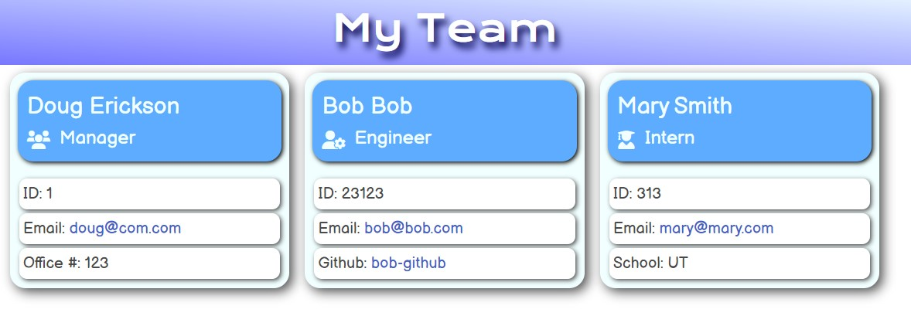

  # Team Page Generator 
  ### A project by: Doug Erickson 

  This project creates a inquirer application that will prompt a user to create an index page to display team members. The application will first prompt for a manager then will allow the user to add as many engineers and interns as they need to. Once done, the application will generate an HTML page with CSS to display the information in an ordered fashion. 

  ---
  ## Table of Contents
  ### [Installation](#installation)
  ### [Usage](#usage)
  ### [Tests](#tests)
  ### [Screenshots/Media](#media)
  ---
  ## Installation
  #### The application requires NodeJS, Inquirer, email-validator and to run tests, jest.

  ## Usage
  #### Run application using 'node app'. Output files will be in the ./output folder. Don't forget the CSS file.

  ## Tests
  #### run 'npm run test' to run all tests. You will need to install jest before running tests.  

  ## Media
  #### 
  
  
  #### Link to video:
  [Video demo of the application in action](TeamPageGenDemo_001a.mp4)